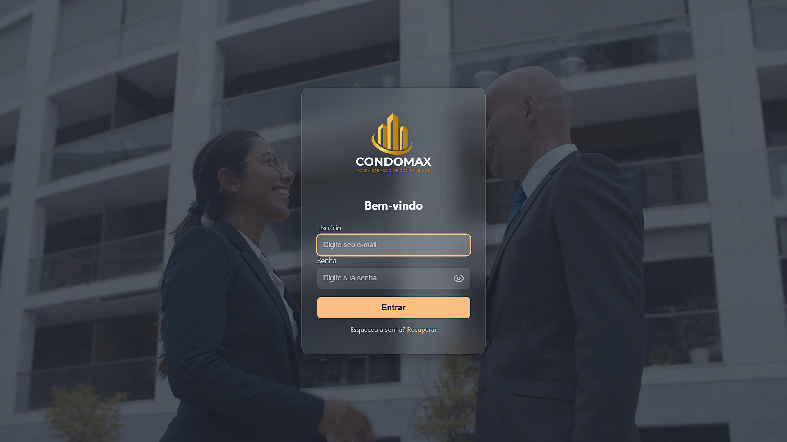
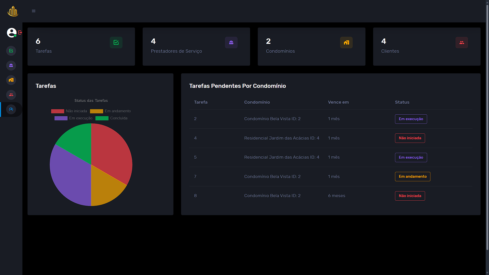

🛠️ CONDOMAX
Sistema de Gestão de Tarefas de Manutenção em Condomínios;

Sistema web desenvolvido como projeto acadêmico em dupla, com foco na gestão de tarefas de manutenção em condomínios. A aplicação permite o controle completo de tarefas, prestadores de serviço, condomínios e usuários, com funcionalidades de cadastro, edição, exclusão e visualização, além de alertas automáticos e autenticação com níveis de acesso.

🚀 Funcionalidades
Gestão detalhada de tarefas com prioridade, status, prazos, repetição automática e cálculo da situação (em dia ou atrasada)
Cadastro de prestadores, condomínios e usuários com níveis de acesso (administrador e comum)
Dashboard intuitivo com indicadores de tarefas pendentes, em andamento, concluídas e a vencer
Alertas para tarefas próximas do vencimento
Relatórios filtrados por condomínio

🧰 Tecnologias Utilizadas
Backend: Laravel 12, PHP 8.x, MySQL, Composer
Frontend: Blade templates, Bootstrap.

💡 Como Rodar o Projeto
Clone este repositório
Configure o ambiente Laravel (instale dependências com composer install)
Configure o arquivo .env com as credenciais do MySQL
Rode as migrations com php artisan migrate
Inicie o servidor local com php artisan serve
Acesse no navegador: http://localhost:8000

